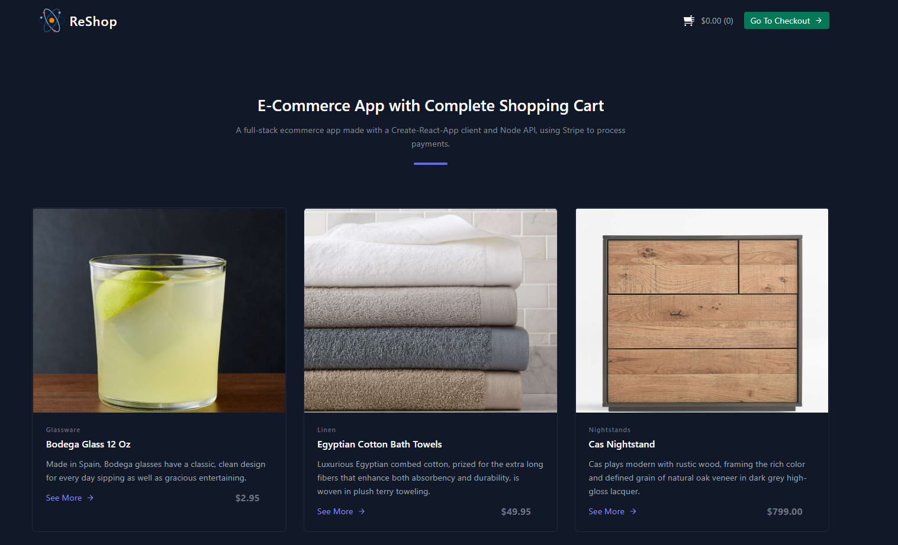
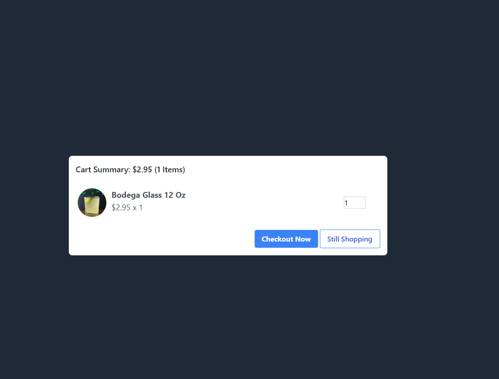
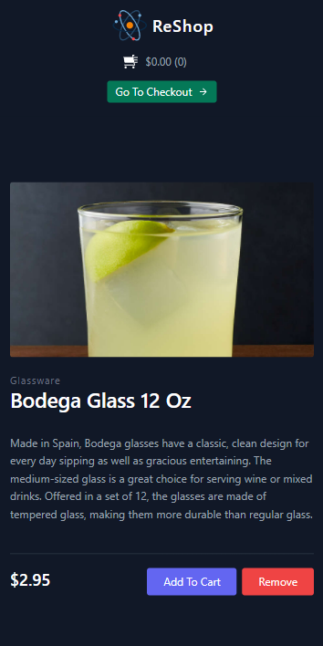
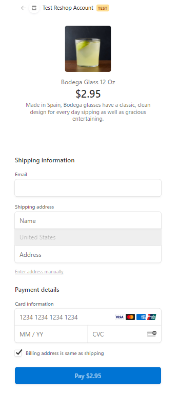

# ReShop

A full-stack ecommerce app made with:

* Front-end
  * React
  * React-query
  * Axios
  * use-shopping-cart

* Backend
  * Node.js
  * Express.js
  * Stripe
  * use-shopping-cart

## Screenshots

 

 

 

 


## Available Scripts

In the project directory, you can run:

### `npm run dev`

Runs the both client and server in the development mode.<br />
Open [http://localhost:3000](http://localhost:3000) to view it in the browser.

The page will reload if you make edits.<br />
You will also see any lint errors in the console.

### `npm test`

Launches the test runner in the interactive watch mode.<br />
See the section about [running tests](https://facebook.github.io/create-react-app/docs/running-tests) for more information.

### `npm run build`

Builds the app for production to the `build` folder.<br />
It correctly bundles React in production mode and optimizes the build for the best performance.

The build is minified and the filenames include the hashes.<br />
Your app is ready to be deployed!

See the section about [deployment](https://facebook.github.io/create-react-app/docs/deployment) for more information.

### `npm run build` fails to minify

This section has moved here: https://facebook.github.io/create-react-app/docs/troubleshooting#npm-run-build-fails-to-minify

### HTTP Request to Node API to return all Products

```const Product = () => {
  const { productId } = useParams();
  const {
    data: product,
    isLoading,
    isError,
    error,
  } = useQuery(["Product", productId], () =>
    axios(`/api/products/${productId}`).then((res) => res.data.product)
  );

  if (isLoading) return <LoadingSpinner />;
  if (isError)
    return (
      <div className="flex items-center justify-center h-screen">
        <div className="text-red-500 font-bold text-center mx-auto">
          Oops! {error.message}
        </div>
      </div>
    );
```
### Integrate Stripe with Node and React

#### App.js
```
async function createCheckoutSession(req, res) {
  try {
    const cartItems = req.body;
    const line_items = validateCartItems(products, cartItems);

    const origin =
      process.env.NODE_ENV === "production"
        ? req.headers.origin
        : "http://localhost:3000";

    const params = {
      submit_type: "pay",
      payment_method_types: ["card"],
      billing_address_collection: "auto",
      shipping_address_collection: {
        allowed_countries: ["US"],
      },
      line_items,
      success_url: `${origin}/result?session_id={CHECKOUT_SESSION_ID}`,
      cancel_url: origin,
      mode: "payment",
    };

    const checkoutSession = await stripe.checkout.sessions.create(params);

    res.status(200).json(checkoutSession);
  } catch (error) {
    res.status(500).json({ statusCode: 500, message: error.message });
  }
}
```
#### route.js

```
const stripePromise = loadStripe('pk_test_51GqhEvBGImU03UKDK9jVTj2ZvyQzHtY2FYbsZ0d0CP2mSnyxCCjDn3uhW0uGSwf8YE7OTnTCdc3ZPChOsnbSYHjs00pphQWve8')

const App = () => {
  return (
    <QueryClientProvider client={queryClient}>
      <CartProvider
        mode='checkout-session'
        stripe={stripePromise}
        currency='USD'
      >
      <Router>
        <Navbar />
        <Toaster position='bottom-center'/>
        <Switch>
          <Route exact path="/" component={Home} />
          <Route path="/result" component={Result} />
          <Route path="/:productId" component={Product} />
        </Switch>
      </Router>
      </CartProvider>
    </QueryClientProvider>
  );
};
```
### Technologies used

<a href="https://developer.mozilla.org/en-US/docs/Web/JavaScript"></a>  <a href="https://developer.mozilla.org/en-US/docs/Web/Guide/HTML/HTML5"></a> <a href="https://www.postgresql.org/download/"></a> <a href="https://reactjs.org/"></a> <a href="https://stripe.com/"></a>

